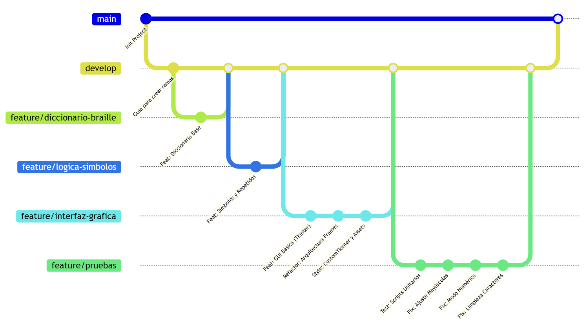

# Documentación del Ambiente de Desarrollo
## Sistema de Transcripción Español-Braille
---

## 2.1. Herramientas Seleccionadas
Para la construcción y evolución del software "Transcriptor Braille", se ha seleccionado un stack tecnológico orientado a la portabilidad, la eficiencia en el desarrollo de escritorio y el aseguramiento de la calidad.

* **Lenguaje de Programación:** Python 3.11.x.
  * *Justificación:* Seleccionado por su capacidad nativa para la manipulación de cadenas de texto y estructuras de datos (diccionarios), esenciales para la lógica de traducción Braille.
* **Entorno de Desarrollo (IDE):** Visual Studio Code.
* **Control de Versiones:** Git (local) y GitHub (repositorio remoto).
* **Interfaz Gráfica (GUI):**
  * `tkinter`: Librería estándar base.
  * `customtkinter`: Librería externa utilizada para modernizar la interfaz de usuario (UI) con widgets estilizados.
  * `Pillow (PIL)`: Para la gestión y renderizado de recursos gráficos (assets) como iconos y fondos.
* **Testing:** `pytest` como herramienta principal para el descubrimiento y ejecución de pruebas automatizadas.
---

## 2.2. Estrategia de Ramificación (Branching Strategy)
Para cumplir con el requisito de estabilidad del código y organizar el desarrollo incremental, se diseñó y aplicó la estrategia **Feature Branch** (Flujo de trabajo por características).

Esta estrategia prohíbe el desarrollo directo en la rama principal, garantizando que solo el código probado y finalizado llegue a producción.

### Convención de Nombres de Ramas
Para mantener el orden en el repositorio, se estableció una convención de nombres estricta para las ramas de trabajo:

- feature/<nombre-funcionalidad>: Para nuevas características (ej. feature/diccionario-braille).

### Estructura de Ramas del Repositorio

| Rama | Tipo | Descripción y Reglas de Uso |
| :--- | :--- | :--- |
| **`main`** | **Producción** | Contiene únicamente la versión estable del software. Está prohibido realizar *commits* directos en esta rama. Solo recibe actualizaciones mediante fusiones (*merges*) desde `develop`. |
| **`develop`** | **Integración** | Es la rama troncal de trabajo. Aquí se centraliza el código proveniente de las distintas funcionalidades una vez terminadas. |
| **`feature/*`** | **Temporal** | Ramas de vida corta creadas a partir de `develop`. Se utilizaron para el desarrollo modular (Lógica, GUI) y para el Aseguramiento de Calidad (rama `feature/pruebas`). Se eliminan tras su fusión. |
| **`documentacion`** | **Soporte** | Rama paralela dedicada exclusivamente al almacenamiento de diagramas, manuales e informes, manteniéndolos separados del código fuente. |
---

## 2.3. Flujo de Trabajo (Workflow)
El ciclo de vida de desarrollo siguió un orden estrictamente incremental, documentado en el historial de Git:

1.  **Lógica:** Se desarrollaron primero las ramas de `diccionario-braille` y `logica-simbolos` para asegurar el motor de traducción.
2.  **Interfaz:** Una vez lista la lógica, se creó la rama `interfaz-grafica` para conectar el motor con las vistas de usuario.
3.  **Pruebas:** Finalmente, con el sistema completo integrado en `develop` (Lógica + GUI), se creó la rama `feature/pruebas` para validar la integridad de todo el software mediante tests automatizados.
---

## 2.4. Diagrama de la Estrategia Aplicada
La siguiente gráfica ilustra la secuencia cronológica real del proyecto, destacando la independencia de las ramas feature y el orden de integración, donde las pruebas se realizaron sobre el sistema completo.



---

## 2.5. Estrategia de Pruebas
Para garantizar la fiabilidad del motor de traducción y cumplir con los requisitos funcionales sin alterar la rama de integración, se ha implementado un sistema de pruebas automatizadas gestionado íntegramente por **Pytest**.

---

### Implementación como Feature
El desarrollo de las pruebas siguió el flujo de trabajo estándar del proyecto:

1.  **Rama de Trabajo:** Se creó la rama `feature/pruebas` derivada de `develop`.
2.  **Ubicación:** Los scripts de prueba se alojaron en el directorio `tests/`, separados del código fuente.
3.  **Fusión:** La rama se integró a `develop` únicamente tras verificar la aprobación de todos los casos.

---

### Tecnologías Utilizadas
* **Framework y Ejecutor:** `pytest`.
  * *Justificación:* Seleccionado por su capacidad de autodescubrimiento de tests, su sistema detallado de reportes de fallos y su facilidad para ejecutar pruebas invocando el módulo de Python directamente.

---

### Procedimiento de Ejecución Documentado
La validación del software se realiza ejecutando el módulo de `pytest` a través del intérprete de Python. Esto asegura que todas las importaciones relativas del proyecto funcionen correctamente en cualquier entorno.

Comando utilizado en el entorno de desarrollo:

```bash
python -m pytest tests/
```

---