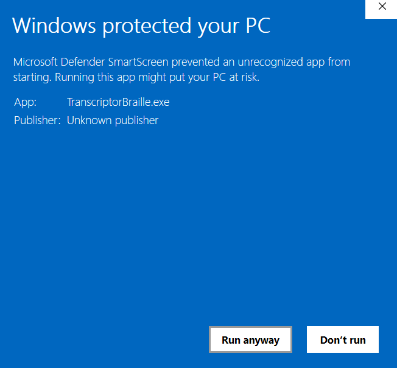
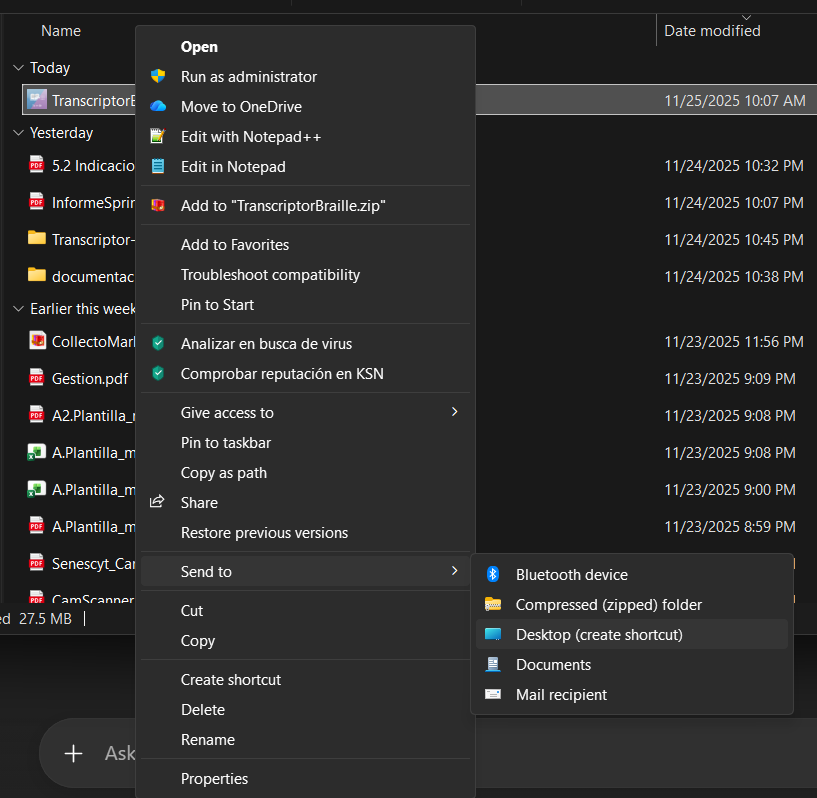
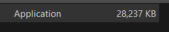
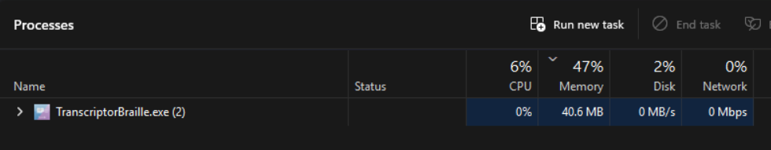

# Manual de Instalación: Transcriptor Braille

**Versión del Documento:** 1.1  
**Fecha:** 24/11/2025

---

## Índice de Contenidos
1. [Introducción](#1-introducción)
2. [Requisitos del Sistema](#2-requisitos-del-sistema)
3. [Descarga del Software](#3-descarga-del-software)
4. [Proceso de Instalación](#4-proceso-de-instalación)
    * [Ubicación del Ejecutable](#paso-1-ubicación-del-ejecutable)
    * [Crear Acceso Directo](#paso-2-creación-de-acceso-directo-opcional)
5. [Verificación de la Instalación](#5-verificación-de-la-instalación)
6. [Solución de Problemas](#6-solución-de-problemas-comunes)
7. [Notas sobre los Requisitos del Sistema](#7-notas-sobre-los-requisitos-del-sistema)

---

## 1. Introducción
Este documento describe los pasos necesarios para instalar y ejecutar el software **Transcriptor Braille**, diseñado para la transcripción de texto en español al sistema Braille.

---

## 2. Requisitos del Sistema

### Requisitos mínimos
* **Sistema Operativo:** Windows 10 o Windows 11  
* **Espacio en Disco:** Mínimo 70 MB libres  
* **Memoria RAM:** Mínimo 2 GB  
* **Dependencias:** No se requiere instalación previa de Python (el ejecutable es autosuficiente)

### Requisitos recomendados
* **Memoria RAM:** 4 GB o más  
* **Resolución de pantalla:** 1280×720 o superior  
* **Espacio en Disco:** 200 MB libres  
* **Conexión a Internet:** Solo necesaria para descargar actualizaciones o consultar el repositorio en GitHub

---

## 3. Descarga del Software
1. Diríjase al repositorio oficial en GitHub:  
   `https://github.com/marcianitauwu/Transcriptor-Braille`
2. En la sección **Versión Estable**, descargue la última versión del archivo ejecutable (`.exe`).
3. Guarde el archivo en una ubicación conocida.

---

## 4. Proceso de Instalación

### Paso 1: Ubicación del Ejecutable
Ubique el archivo descargado:

`TranscriptorBraille.exe`

> **Nota:** Si Windows Defender muestra una advertencia, seleccione “Más información” → “Ejecutar de todas formas”.

### Paso 2: Creación de Acceso Directo (Opcional)
1. Haga clic derecho sobre el archivo `TranscriptorBraille.exe`.  
2. Seleccione **Enviar a → Escritorio (crear acceso directo)**.

---

## 5. Verificación de la Instalación
1. Haga doble clic en el archivo ejecutable o en el acceso directo creado.  
2. El programa debe abrirse mostrando la pantalla principal.

---

## 6. Solución de Problemas Comunes

| Problema | Solución |
|---------|----------|
| El programa no abre | Ejecute como administrador o verifique su antivirus. |
| Error de visualización | Ajuste la escala de pantalla al 100% en Configuración de Pantalla. |

---

## 7. Notas sobre los Requisitos del Sistema

Aunque el archivo ejecutable pesa aproximadamente **29 MB**, y el programa podría funcionar con menos espacio o menos memoria, se recomiendan valores superiores por las siguientes razones:

  

### **1. Margen para archivos temporales**
Durante la ejecución, el programa puede generar archivos adicionales, configuraciones o caché que requieren espacio adicional.

### **2. Comportamiento variable del consumo de RAM**
Según el Administrador de tareas, el programa utiliza aproximadamente **40 MB de RAM** en reposo.  
Sin embargo, su consumo puede aumentar al:
- Procesar textos largos  
- Usar funciones adicionales  
- Ejecutarse junto con otros procesos del sistema  

Un margen evita que Windows cierre procesos por falta de memoria disponible.

### **3. Requerimientos del sistema operativo**
Windows puede usar entre **1.5 y 2 GB de RAM** solo para el escritorio y procesos base.  
Por ello, aunque el programa sea ligero, un equipo con poca memoria podría funcionar con lentitud si no se deja un margen suficiente.

### **4. Uso del margen x4 – x8 para determinar RAM recomendada**
Para documentar requisitos mínimos de forma correcta, se usa una regla general:

- **x4 del consumo promedio** → margen seguro  
- **x8 del consumo promedio** → margen óptimo  

Aplicado al consumo real:
- Consumo aproximado: **40 MB**  
- x4 → **160 MB**  
- x8 → **320 MB**

En teoría serían suficientes, pero **estos valores no consideran el consumo real del sistema operativo**, que ya utiliza alrededor de 2 GB.  
Por este motivo, se fija como mínimo recomendable:

 **2 GB de RAM** (mínimo realista para que Windows + el programa funcionen sin problemas).

### **5. Buenas prácticas de documentación**
Los requisitos mínimos deben reflejar un rango seguro que asegure:
- Funcionamiento estable  
- Compatibilidad con distintos equipos  
- Evitar errores por falta de recursos  

Por esta razón, aunque el ejecutable ocupe **29 MB** y use apenas **40 MB de RAM**, se recomienda pedir **70 MB de espacio** y **2 GB de RAM mínimos** para garantizar estabilidad en cualquier equipo.

---
