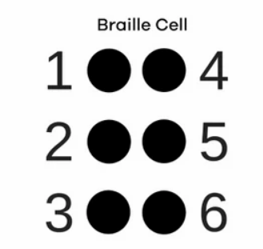
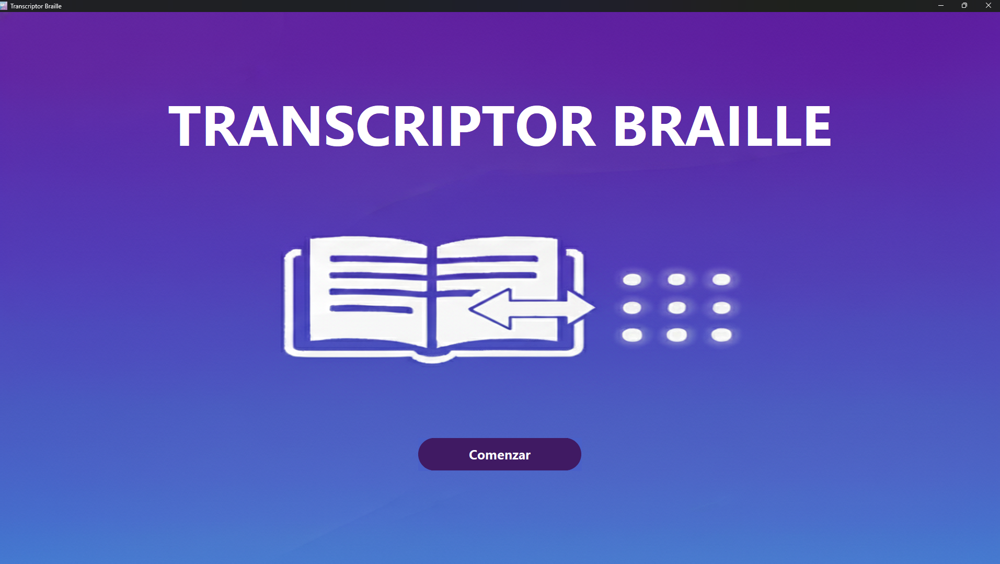
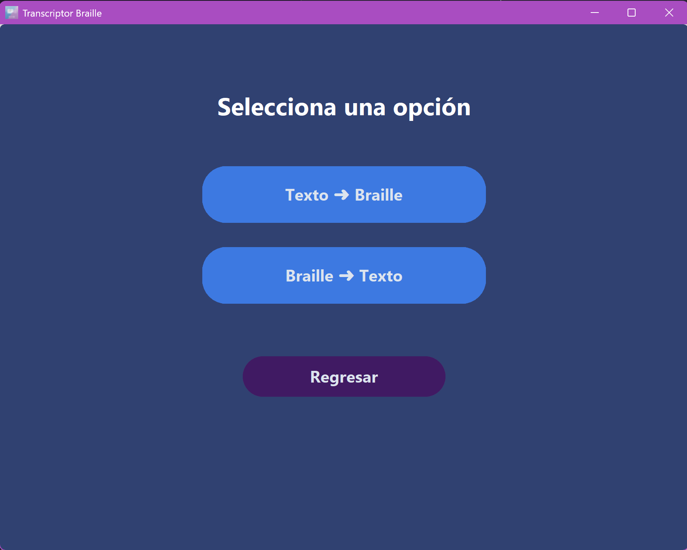
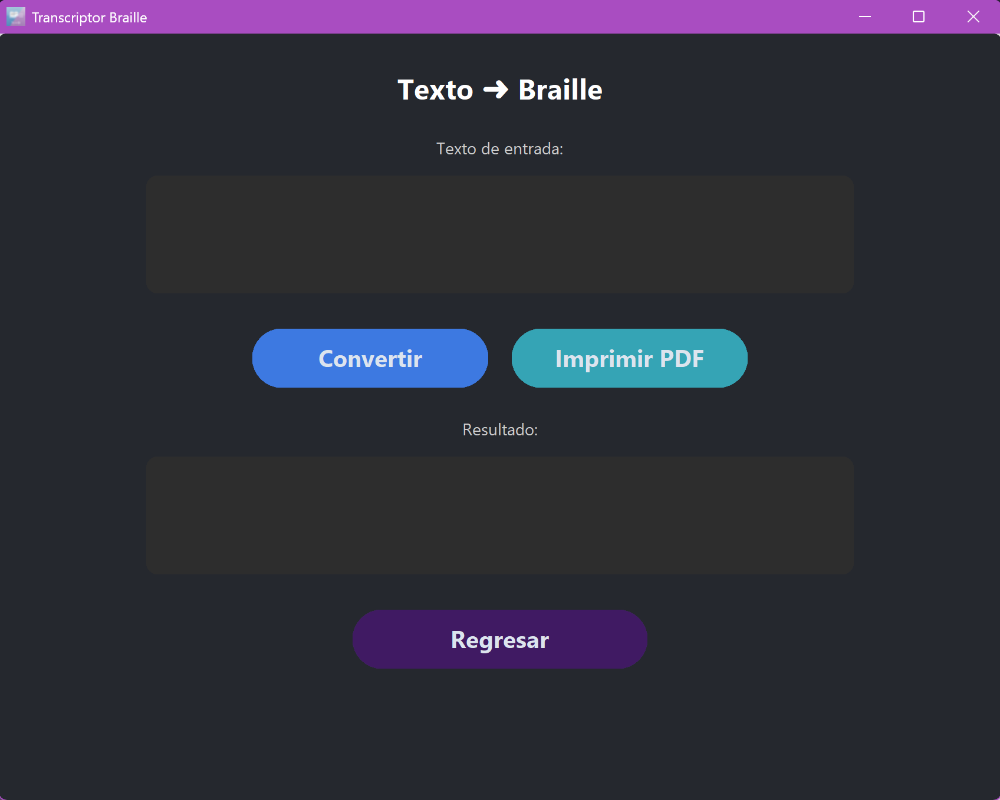
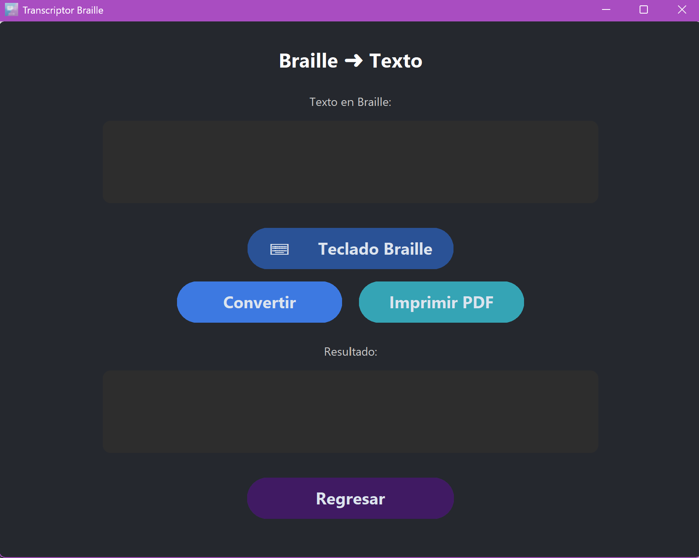
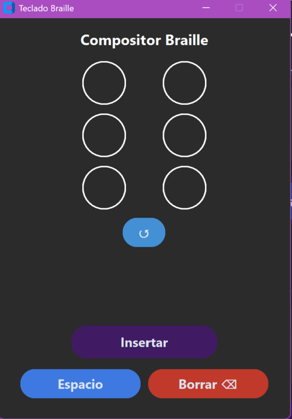
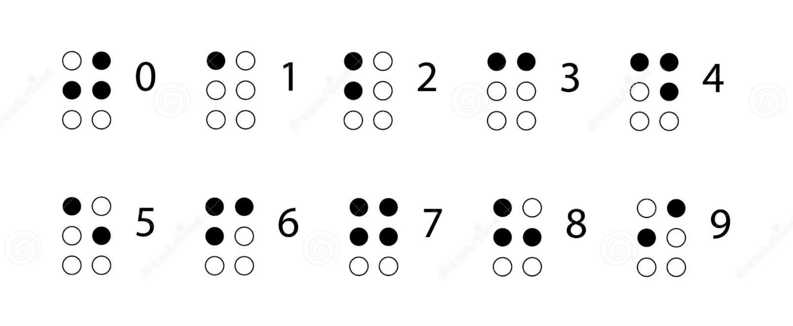
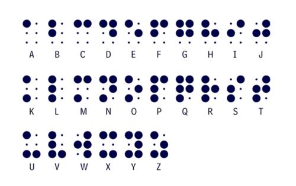

# Manual de Usuario: Transcriptor Braille

**Versión del Software:** 2.0

---

## Índice de Contenidos
- [Manual de Usuario: Transcriptor Braille](#manual-de-usuario-transcriptor-braille)
  - [Índice de Contenidos](#índice-de-contenidos)
  - [1. Descripción y Finalidad](#1-descripción-y-finalidad)
    - [Finalidad del Producto](#finalidad-del-producto)
  - [2. Conceptos Básicos: El Sistema Braille](#2-conceptos-básicos-el-sistema-braille)
  - [3. Interfaz de Usuario](#3-interfaz-de-usuario)
    - [3.1 Pantalla Inicial](#31-pantalla-inicial)
    - [3.2 Menú de Opciones](#32-menú-de-opciones)
    - [3.3 Pantalla de Conversión Texto → Braille](#33-pantalla-de-conversión-texto--braille)
    - [3.4 Pantalla de Conversión Braille → Texto](#34-pantalla-de-conversión-braille--texto)
    - [3.5 Pantalla del Teclado Braille Virtual](#35-pantalla-del-teclado-braille-virtual)
  - [4. Cómo Usar el Programa](#4-cómo-usar-el-programa)
  - [5. Reglas de Transcripción Detalladas](#5-reglas-de-transcripción-detalladas)
    - [5.1 Números y Cantidades](#51-números-y-cantidades)
    - [5.2 Alfabeto y Series](#52-alfabeto-y-series)
  - [6. Ejemplos de Aplicación (Señalética)](#6-ejemplos-de-aplicación-señalética)

---

## 1. Descripción y Finalidad
**Transcriptor Braille** es una herramienta de software diseñada para transcribir texto en español al sistema Braille estándar.

### Finalidad del Producto
Permite que cualquier persona pueda generar, de forma sencilla y económica, **señalética accesible en Braille** para:
* Edificios y espacios públicos.
* Ascensores y paneles informativos.
* Electrodomésticos, controles y aparatos electrónicos.
* Juegos de mesa, medicamentos, alimentos y etiquetas personalizadas.

---

## 2. Conceptos Básicos: El Sistema Braille

El Braille se basa en un **cuadratín de seis puntos**, organizados así:

Cada carácter se crea activando combinaciones específicas de estos puntos.

---

## 3. Interfaz de Usuario

El programa contiene cinco pantallas principales:

---

### 3.1 Pantalla Inicial

Elementos:
- **Título del programa**
- **Botón “Comenzar”**: inicia el flujo principal.

---

### 3.2 Menú de Opciones

Opciones:
1. **Texto → Braille**
2. **Braille → Texto**
3. **Regresar** (volver a la pantalla inicial)

---

### 3.3 Pantalla de Conversión Texto → Braille

Componentes:
- **Área de entrada:** texto en español.
- **Botón Convertir:** realiza la transcripción.
- **Imprimir:** Guarda la traducción en un documento.  
- **Área de salida:** muestra el resultado en Braille.
- **Botón Regresar:** vuelve al menú.

Ejemplo mostrado:

---

### 3.4 Pantalla de Conversión Braille → Texto

Componentes:
- **Área de entrada:** braille.
- **Botón "⌨️ Teclado Braille":** Abre la ventana flotante de composición manual.  
- **Botón Convertir:** Traduce la secuencia de puntos a letras y números en español.
- **Imprimir:** Guarda la traducción en un documento.  
- **Área de salida:** muestra el resultado en español.
- **Botón Regresar:** vuelve al menú.

Ejemplo mostrado:

---

### 3.5 Pantalla del Teclado Braille Virtual

Esta pantalla permite al usuario escribir caracteres Braille de forma manual mediante un teclado virtual que simula el cuadratín Braille de seis puntos.

Componentes de la Pantalla

- **Cuadratín Braille (seis puntos):**  
  Consta de seis botones circulares dispuestos en dos columnas de tres puntos cada una.  
  Cada botón representa un punto del sistema Braille (puntos 1 al 6).  
  Al presionar un botón, el punto se activa o desactiva.

- **Vista previa del carácter Braille:**  
  Muestra en tiempo real el carácter Braille generado a partir de la combinación de puntos activados, permitiendo al usuario verificar el símbolo antes de insertarlo.

- **Botón Insertar:**  
  Inserta el carácter Braille visualizado en la vista previa dentro del área de texto activa del programa.

- **Botón Espacio:**  
  Inserta un espacio en el texto, permitiendo la separación entre palabras.

- **Botón Borrar Texto:**  
  Elimina el último carácter ingresado en el área de texto.

- **Botón Reiniciar (↺):**  
  Apaga todos los puntos del cuadratín Braille para iniciar una nueva combinación.

El Teclado Braille Virtual está diseñado para:
- Facilitar el aprendizaje del sistema Braille.
- Permitir la edición manual de texto en Braille.
- Complementar la conversión automática entre texto y Braille.

Ejemplo mostrado:

---

## 4. Cómo Usar el Programa

1. Ejecute el archivo `TranscriptorBraille.exe`.
2. En la pantalla inicial, presione **Comenzar**.
3. Seleccione una opción del menú:
   - **Texto → Braille**
   - **Braille → Texto**
4. Ingrese el contenido según la conversión seleccionada.
5. Para escribir Braille manualmente:
   - Abra el **Teclado Braille Virtual**.
   - Active los puntos necesarios para formar el carácter.
   - Observe el resultado en la vista previa.
   - Presione **Insertar** para agregar el carácter al texto.
6. Use **Espacio** o **Borrar Texto** si es necesario.
7. Presione **Convertir** para obtener el resultado final.
8. Utilice **Regresar** para volver al menú principal.

---

## 5. Reglas de Transcripción Detalladas

El software aplica las normas oficiales del Braille Español.

---

### 5.1 Números y Cantidades

Reglas:
* El prefijo utilizado es `⠼`
* Los dígitos del **1 al 0** requieren el **signo de número** `⠼` (puntos 3-4-5-6).
* El signo de número se escribe **solo una vez** al inicio de la cifra.
* Se permiten separadores como puntos, comas y espacios.

Ejemplos:
* `12,3`
* `2.329.724`

---

### 5.2 Alfabeto y Series

* El prefijo utilizado para mayúsculas es `⠨`
* **Serie 1 (a–j):** puntos superiores.
* **Serie 2 (k–t):** serie 1 + punto 3.
* **Serie 3 (u–z):** serie 1 + puntos 3 y 6.
* Manejo de:
  - Mayúsculas (con indicador)
  - Ñ
  - Espaciado estándar
  - Signos básicos

---

## 6. Ejemplos de Aplicación (Señalética)

| Texto en Tinta | Braille Generado |
| :------------ | :---------------- |
| **7** | `⠼⠛` |
| **PB** | `⠨⠏⠨⠃` |

---